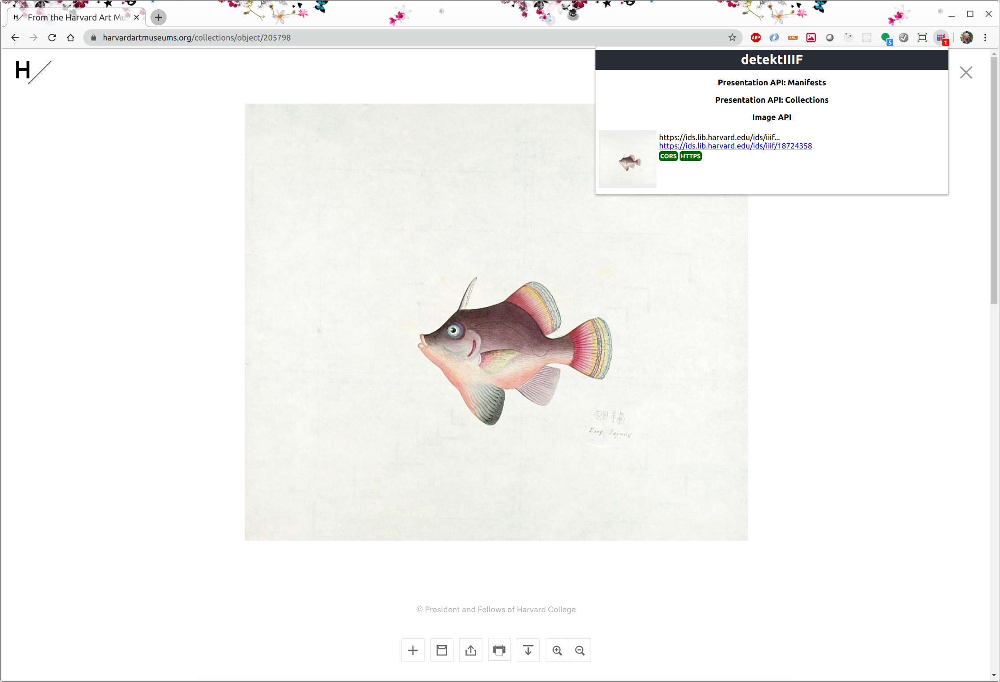
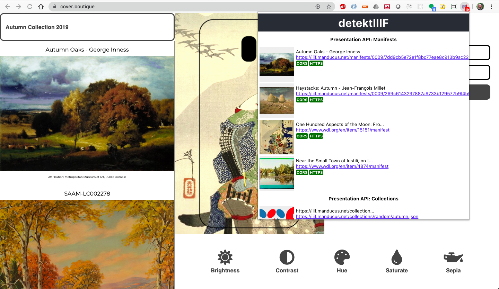

# detektIIIF

This is a chrome extension to discover IIIF resources and links in websites. It is just a proof-of-concept, it is work not-in-progress-anymore and it surely will contain bugs. I would like to inspire people to build extensions like this for popular browsers. Please do it better than I did.





## Inspired by and based on these articles:

https://medium.com/@gilfink/building-a-chrome-extension-using-react-c5bfe45aaf36

https://medium.com/@gilfink/adding-web-interception-abilities-to-your-chrome-extension-fb42366df425

This project was bootstrapped with [Create React App](https://github.com/facebook/create-react-app).


## Examples:

### Presentation and Image API:

https://www.nga.gov/collection/art-object-page.130898.html

https://cover.boutique/ (Collections)

https://manducus.net/iiifcurator/ (Collections)

https://norman.hrc.utexas.edu/mirador/p15878coll33 (no CORS, at the time of writing)

https://projectmirador.org/demo/ (a lot of content)

### Image API only:

https://digital.deutsches-museum.de/item/3720/

https://nationalmuseumse.iiifhosting.com/iiif/e08e5377e1e0f2f787132affd3742e795e07cd84e79d4c2f77f97de3d22a993/

## How to use

1. ```git clone https://github.com/leanderseige/detektiiif```

2. ```npm install```

3. ```npm run build```

4. in Chrome open the Extensions page, turn on developer mode and click "load unpacked", choose the build folder of this repo
